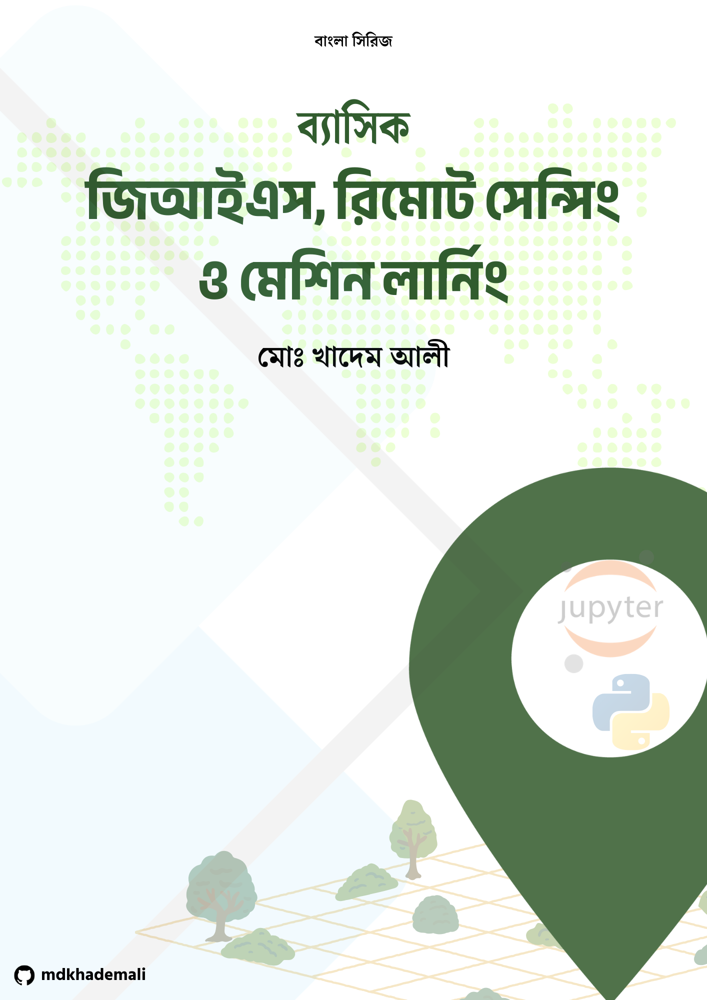

# ব্যাসিক জিআইএস, রিমোট সেন্সিং এবং মেশিন লার্নিং সিরিজ (বাংলা)

**Md. Khadem Ali**  
Student, Dept. of Geography & Environment  
Shahid M. Mansur Ali College (Affiliated with National University of Bangladesh)  
[Portfolio: www.khademali.com](http://www.khademali.com)

---

## সিরিজ সম্পর্কে

এই সিরিজে GIS ও Remote Sensing ডেটার প্রক্রিয়াকরণ, বিশ্লেষণ, ভিজ্যুয়ালাইজেশন, Machine Learning এবং Deep Learning মডেল তৈরি ও deploy করার পুরো workflow শেখানো হয়েছে। প্রতিটি পর্বে ধাপে ধাপে উদাহরণ এবং কোড সহ বিস্তারিত ব্যাখ্যা দেওয়া হয়েছে। সিরিজটি বিশেষভাবে শিক্ষার্থী, গবেষক এবং প্রজেক্ট ডেভেলপারদের জন্য তৈরি করা হয়েছে, যাতে তারা Practical GIS ও Remote Sensing ML প্রজেক্টগুলো সহজে বুঝতে পারে এবং বাস্তবায়ন করতে পারে। এছাড়া, এই সিরিজটি ডেটা প্রক্রিয়াকরণ, মডেলিং, ফলাফল ভিজ্যুয়ালাইজেশন এবং রিপোর্ট তৈরির প্রক্রিয়ায় সাহায্য করার জন্যও লক্ষ্যবদ্ধ। 
  
---

## সিরিজের বিস্তারিত পর্বসমূহ

| পর্ব | বিষয়বস্তু | সংক্ষিপ্ত বিবরণ |
|------|------------|----------------|
| ১ | পরিচিতি | GIS, Remote Sensing এবং Machine Learning এর মৌলিক ধারণা; Spatial Data এবং Raster/Vector ডেটার প্রাথমিক ধারণা |
| ২ | Data Preprocessing | CRS পরিবর্তন ও ম্যানেজমেন্ট; Missing Data handling; Normalization ও Scaling; Train-test split |
| ৩ | Basic Machine Learning Models | Linear Regression; Logistic Regression; Decision Tree; Random Forest |
| ৪ | Advanced Machine Learning | Gradient Boosting; Hyperparameter tuning; Feature Importance; Model evaluation techniques |
| ৫ | Deep Learning (CNN for Remote Sensing) | CNN পরিচিতি; Dataset প্রস্তুতি (Image Tiles); CNN মডেল ট্রেনিং ও Evaluation |
| ৬ | Data Visualization & Mapping | Vector ও Raster ডেটার ভিজ্যুয়ালাইজেশন; Layer overlay ও styling; Interactive Maps (Folium) |
| ৭ | Time Series Analysis in Remote Sensing | NDVI/Vegetation Index time series; Seasonal pattern ও trend detection; Rolling mean ও trend visualization |
| ৮ | Change Detection in Remote Sensing | Image differencing; NDVI বা অন্যান্য indices ব্যবহার; Spatial overlay ও significant changes visualization |
| ৯ | Classification of Remote Sensing Data | Supervised ও Unsupervised Classification; Random Forest Classification উদাহরণ; Training ও Validation; Classified Map visualizations |
| ১০ | Accuracy Assessment & Reporting | Confusion Matrix ও Overall Accuracy; Kappa Coefficient ও Class-wise Accuracy; Charts ও CSV রিপোর্ট তৈরির উদাহরণ |
| ১১ | সমাপনী পর্ব (Conclusion & Best Practices) | সিরিজের সংক্ষিপ্ত রিভিউ; Workflow summary: Data collection → Preprocessing → Feature Extraction → Modeling → Evaluation → Visualization → Reporting; Best Practices ও Common Pitfalls; Future directions ও Practical tips |

---

## কভার ছবি

## প্রয়োজনীয়তা

- Python (3.8+)  
- Jupyter Notebook / Jupyter Lab  
- Libraries: geopandas, rasterio, numpy, pandas, matplotlib, seaborn, scikit-learn, tensorflow, folium

© mdkhademali